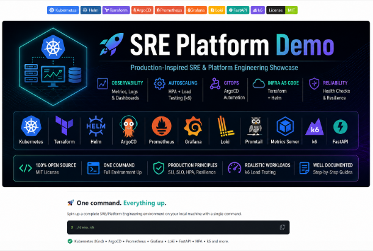
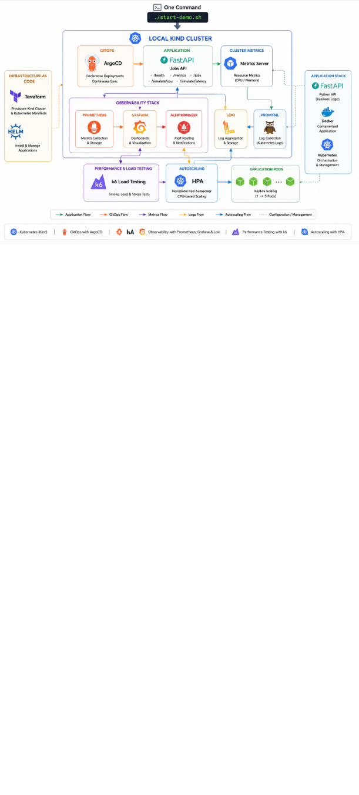
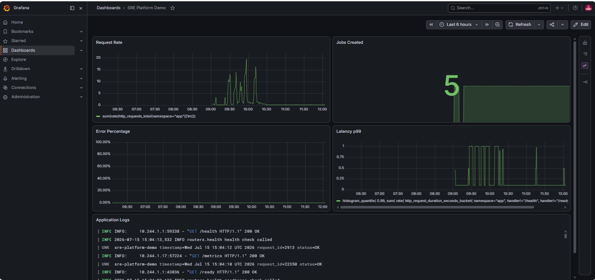
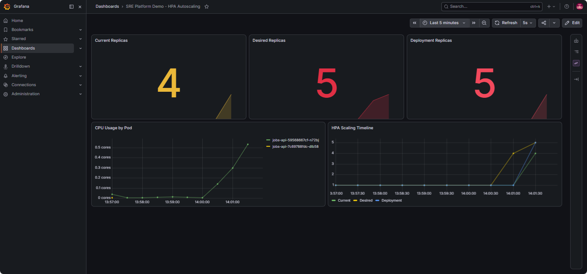
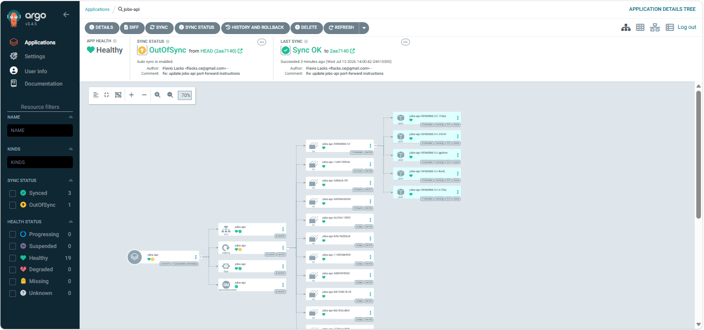
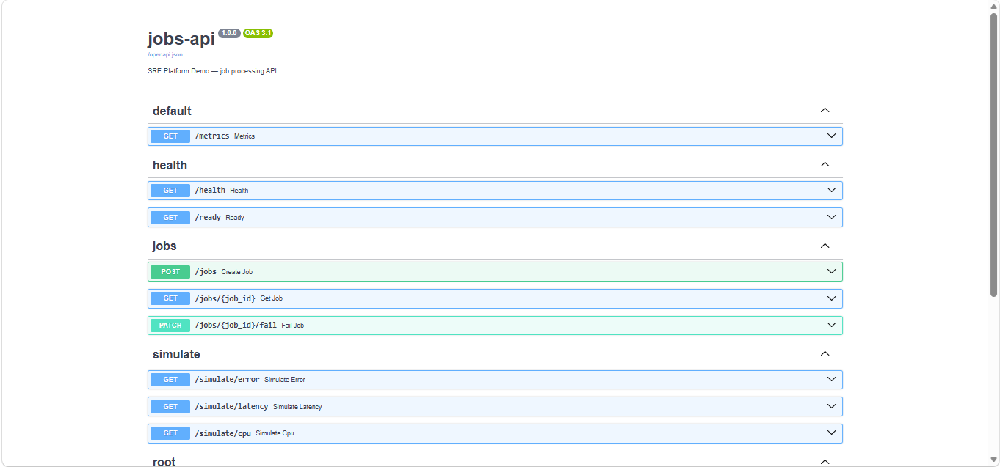
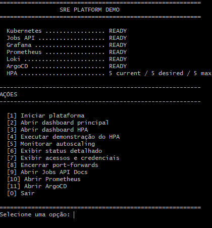

# 🚀 SRE Platform Demo

<p align="center">
  
</p>

> **A production-inspired local Platform Engineering environment designed to demonstrate modern Site Reliability Engineering practices end-to-end.**

<p align="center">


</p>

---

## 🚀 Production-inspired Platform Engineering Showcase

> This project demonstrates how modern Site Reliability Engineering practices can be implemented locally using Kubernetes, GitOps, Infrastructure as Code, Observability, Horizontal Pod Autoscaling and Performance Testing.

---

## 📑 Table of Contents

- [🚀 Live Demo](#-live-demo)
- [🏗️ Architecture](#️-architecture)
- [✨ Features](#-features)
- [🛠️ Technology Stack](#️-technology-stack)
- [🚀 Quick Start](#-quick-start)
- [📊 Observability](#-observability)
- [⚡ HPA & Load Testing](#-hpa--load-testing)
- [📂 Project Structure](#-project-structure)
- [📸 Screenshots](#-screenshots)
- [👤 About the Author](#-about-the-author)
- [📄 License](#-license)

---

# 🎬 Live Demo

> *(GIF coming soon)*

## 💡 Why this project?

Modern Site Reliability Engineers are expected to build far more than Kubernetes clusters.

They automate infrastructure, deploy applications through GitOps, monitor production systems, implement observability, troubleshoot incidents and validate scalability using performance testing.

This repository demonstrates those capabilities through a fully reproducible local Platform Engineering environment.

Everything can be started using a single command:

```bash
./demo.sh
```

---

# ✨ Features

- 🚀 One-command platform startup
- ☸️ Kubernetes (Kind)
- 🌍 Infrastructure as Code (Terraform)
- 📦 Helm deployments
- 🔄 GitOps with ArgoCD
- 📈 Prometheus monitoring
- 📊 Grafana dashboards
- 📜 Centralized logging with Loki
- ⚡ Horizontal Pod Autoscaler (HPA)
- 🔥 Integrated k6 Load Testing
- 🐍 FastAPI demo application
- 📖 Interactive Swagger documentation

---

## 🏗️ Architecture

The platform simulates a production-inspired SRE environment running locally on Kubernetes (Kind). It combines GitOps, Infrastructure as Code, Observability and Autoscaling into a single reproducible platform.

<p align="center">
    
</p>

### Components

| Component | Purpose |
|-----------|---------|
| Terraform | Provision the local infrastructure |
| Helm | Deploy and manage Kubernetes applications |
| ArgoCD | GitOps continuous delivery |
| FastAPI | Demo application exposing metrics and simulation endpoints |
| Prometheus | Metrics collection and storage |
| Grafana | Dashboards and visualization |
| Loki | Centralized log aggregation |
| Promtail | Log collection from Kubernetes |
| Metrics Server | Kubernetes resource metrics |
| HPA | Horizontal Pod Autoscaler |
| k6 | Load, smoke and stress testing |

# 🧰 Technology Stack

| Category | Technology |
|------------|------------|
| Container Orchestration | Kubernetes (Kind) |
| Infrastructure as Code | Terraform |
| Package Management | Helm |
| GitOps | ArgoCD |
| Monitoring | Prometheus |
| Dashboards | Grafana |
| Logging | Loki + Promtail |
| Autoscaling | Horizontal Pod Autoscaler |
| Load Testing | Grafana k6 |
| API | FastAPI |
| Language | Python |


---

## 📸 Screenshots

### Main Dashboard

<p align="center">
    
</p>

The executive dashboard provides a high-level view of request rate, latency, error percentage, logs and application activity.

---

### HPA Dashboard

<p align="center">
    
</p>

This dashboard demonstrates Horizontal Pod Autoscaler behavior during load tests executed with k6.

---

### GitOps with ArgoCD

<p align="center">
    
</p>

ArgoCD continuously synchronizes Kubernetes resources directly from Git.

---

### API Documentation

<p align="center">
    
</p>

The demo application exposes a complete OpenAPI/Swagger interface.

---

### Interactive Demo Menu

<p align="center">
    
</p>

The entire environment can be controlled through a single interactive Bash launcher.


---

# 📋 Requirements

Before running the project, make sure the following tools are installed:

- Docker Desktop
- Git
- kubectl
- Kind
- Helm
- Terraform

---

# 🚀 Quick Start

Clone the repository:

```bash
git clone https://github.com/flacks-cel/sre-platform-demo

cd sre-platform-demo
```

Start the entire platform:

```bash
./demo.sh
```

The launcher automatically:

- Creates the Kubernetes cluster
- Deploys the application
- Configures Grafana
- Configures Prometheus
- Configures Loki
- Configures ArgoCD
- Starts port-forwards
- Opens dashboards
- Runs platform checks

---

# 🎯 Demonstration Flow

```text
demo.sh

↓

Start Platform

↓

Open Grafana

↓

Observe Metrics

↓

Observe Logs

↓

Run HPA Test

↓

Watch Autoscaling

↓

Validate GitOps

↓

Done
```

---

# 📁 Repository Structure

```text
.
├── app/
├── infra/
├── load-testing/
├── local/
├── observability/
├── docs/
│   └── images/
├── demo.sh
├── README.md
└── LICENSE
```

---

# 🎯 What this project demonstrates

This project showcases practical experience with:

- Platform Engineering
- Site Reliability Engineering
- Infrastructure as Code
- GitOps
- Kubernetes
- Observability
- Monitoring
- Centralized Logging
- Autoscaling
- Performance Testing
- Automation
- Production-like troubleshooting
- GitOps operational workflow

---

# 🛣 Roadmap

- ✅ Kubernetes Platform
- ✅ Terraform
- ✅ Helm
- ✅ GitOps
- ✅ Prometheus
- ✅ Grafana
- ✅ Loki
- ✅ HPA
- ✅ k6
- ✅ Interactive Demo Launcher
- ⏳ Demo GIF
- ⏳ Demonstration Video

---

# 👨‍💻 About the Author

## Flavio Lacks

**Senior Site Reliability Engineer | Platform Engineer | DevOps Engineer**

Passionate about Platform Engineering, Kubernetes, Cloud Infrastructure, Observability and Automation.

This project was designed and implemented to simulate a production-inspired SRE platform, demonstrating Infrastructure as Code, GitOps, Observability, Horizontal Pod Autoscaling, Performance Testing and operational excellence in a fully reproducible local Kubernetes environment.

- 💼 LinkedIn  
  https://www.linkedin.com/in/flaviolacks/

- 💻 GitHub  
  https://github.com/flacks-cel

---

# 📄 License

This project is licensed under the **MIT License**.

See the [LICENSE](LICENSE) file for details.

---

<p align="center">

© 2026 Flavio Lacks

</p>