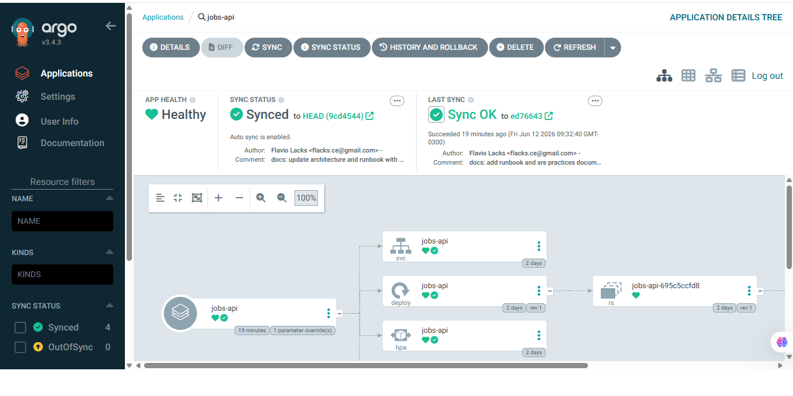
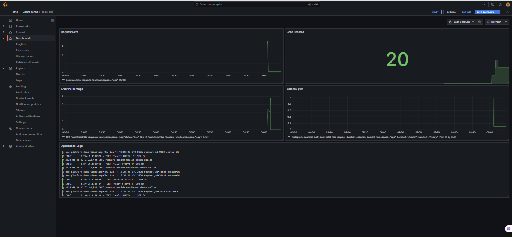

# SRE Platform Demo

[](https://github.com/flacks-cel)
[](https://www.linkedin.com/in/flaviolacks/)

A production-inspired SRE platform demonstrating modern DevOps, GitOps and Site Reliability Engineering practices using FastAPI, Docker, Prometheus, Grafana, Loki, Promtail, Terraform, Kubernetes Kind, Helm, ArgoCD and GitHub Actions.

## Additional Documentation

* [Project Overview](docs/project-overview.md)
* [Architecture](docs/architecture.md)
* [Project Status](docs/project-status.md)

---

## Project Goals

This project was created to demonstrate:

* Infrastructure as Code with Terraform
* Containerization with Docker
* Kubernetes orchestration using Kind
* Helm-based application deployments
* GitOps workflows using ArgoCD
* Observability with Prometheus, Grafana, Loki and Promtail
* Metrics collection and dashboard visualization
* Centralized application logging
* CI/CD automation with GitHub Actions
* Health checks and readiness probes
* Automated testing and code quality
* SRE-oriented troubleshooting and operational visibility

---

## Architecture

```text
GitHub Repository
        ↓
     ArgoCD
        ↓
 Helm Deployments
        ↓
Kind Kubernetes Cluster
        ↓
   FastAPI Jobs API

Application Metrics
        ↓
   Prometheus
        ↓
    Grafana

Application Logs
        ↓
    Promtail
        ↓
      Loki
        ↓
    Grafana

Terraform
        ↓
Infrastructure Provisioning
```

---

## GitOps with ArgoCD

This project implements GitOps practices using ArgoCD to continuously synchronize the Kubernetes cluster with the desired state stored in Git.

The application is deployed through a Helm chart managed by ArgoCD, providing automated synchronization, continuous reconciliation and self-healing capabilities.

### ArgoCD Application



Features:

* GitOps deployment model
* Continuous reconciliation
* Automatic synchronization
* Helm-based deployments
* Self-healing Kubernetes workloads
* Horizontal Pod Autoscaler (HPA) management

The application source is stored in this repository and synchronized automatically by ArgoCD.

---

## Dashboard Preview



The Grafana dashboard provides visibility into:

* Request Rate
* Error Percentage
* Jobs Created
* Latency p99
* Application Logs

---

## Observability

The platform includes a complete observability stack:

* Prometheus for metrics collection
* Grafana for visualization
* Loki for centralized logging
* Promtail for log shipping
* Custom Grafana dashboards for application metrics and logs

### Custom Dashboards

Dashboard definitions are versioned as code in:

```text
observability/grafana/dashboards/
```

Available dashboards:

```text
jobs-api-observability.json
```

Dashboard for application metrics:

* Request Rate
* Error Percentage
* Jobs Created
* Latency p99

```text
jobs-api-logs-only.json
```

Dashboard for application logs using Loki.

---

## Quick Start

### Start the Environment

Start the local environment:

```bash
docker compose up -d --build
```

For the complete local demo environment:

```bash
./local/start-demo.sh
```

The local startup script provisions infrastructure, configures observability, installs Loki, Promtail and prepares demo data automatically.

---

## Access URLs

| Component  | URL                   |
| ---------- | --------------------- |
| Grafana    | http://localhost:3000 |
| Prometheus | http://localhost:9090 |
| API        | http://localhost:8000 |
| Loki       | http://localhost:3102 |
| ArgoCD     | http://localhost:8080 |

---

## Application Endpoints

| Endpoint                      | Description                   |
| ----------------------------- | ----------------------------- |
| `/health`                     | Health check endpoint         |
| `/ready`                      | Readiness check endpoint      |
| `/metrics`                    | Prometheus metrics endpoint   |
| `/jobs`                       | Job creation endpoint         |
| `/simulate/error`             | Simulates application errors  |
| `/simulate/latency?seconds=1` | Simulates application latency |

Example job creation:

```bash
curl -X POST http://localhost:8000/jobs \
  -H "Content-Type: application/json" \
  -d '{"name":"demo-job","payload":{"source":"interview-demo"}}'
```

---

## Prometheus

Prometheus scrapes metrics from the `jobs-api` service.

Configuration:

```text
observability/prometheus/prometheus.yml
```

Targets page:

```text
http://localhost:9090/targets
```

Expected status:

```text
jobs-api UP
```

---

## Observability Notes

Grafana dashboards rely on Prometheus metrics labeled with:

```yaml
namespace: app
```

Prometheus injects this label into the scrape target:

```yaml
static_configs:
  - targets: ["jobs-api:8000"]
    labels:
      namespace: "app"
```

Several dashboard panels use PromQL filters such as:

```promql
http_requests_total{namespace="app"}
```

and:

```promql
http_request_duration_seconds_bucket{namespace="app"}
```

If this label is removed or renamed, Grafana panels may display **No Data** even when Prometheus is successfully scraping metrics.

---

## Loki and Application Logs

Application logs are collected by Promtail and sent to Loki.

Grafana accesses Loki using:

```text
http://host.docker.internal:3102
```

This URL is required because Grafana runs inside Docker while Loki is exposed through a Kubernetes port-forward.

The logs dashboard displays:

* Health check requests
* Readiness check requests
* Job creation events
* Simulated errors
* Latency simulation requests

---

## ArgoCD Deployment

ArgoCD monitors this repository and continuously reconciles the cluster state.

Application source:

```text
Repository:
https://github.com/flacks-cel/sre-platform-demo

Path:
infra/helm/jobs-api
```

ArgoCD capabilities demonstrated:

* Continuous synchronization
* Drift detection
* Self-healing deployments
* Declarative Kubernetes management
* Helm integration
* GitOps workflows

---

## Demo Data Generation

The local demo script automatically generates:

* HTTP request traffic
* Job creation events
* Error simulation
* Latency simulation
* Application logs

Useful manual commands:

```bash
for i in {1..20}; do curl http://localhost:8000/health; done
```

```bash
curl -X POST http://localhost:8000/jobs \
  -H "Content-Type: application/json" \
  -d '{"name":"demo-job","payload":{"source":"manual-test"}}'
```

```bash
curl http://localhost:8000/simulate/error
```

```bash
curl "http://localhost:8000/simulate/latency?seconds=1"
```

---

## Technology Stack

* FastAPI
* Python
* Docker
* Docker Compose
* Terraform
* Kubernetes Kind
* Helm
* ArgoCD
* Prometheus
* Grafana
* Loki
* Promtail
* GitHub Actions

---

## Repository Structure

```text
.
├── .github/workflows
├── app/api
├── docs
│   └── images
│       ├── grafana-dashboard.png
│       └── argocd-application-tree.png
├── infra
│   ├── helm
│   └── terraform
├── observability
│   ├── grafana
│   └── prometheus
├── Dockerfile
├── docker-compose.yml
├── pyproject.toml
└── README.md
```

---

## CI/CD

The project includes GitHub Actions workflows for:

* Automated validation
* Testing
* Code quality checks
* Container workflow preparation

Workflow files:

```text
.github/workflows/
```

---

## SRE and DevOps Concepts Demonstrated

This project demonstrates practical SRE, DevOps and Platform Engineering concepts:

* Infrastructure as Code
* GitOps workflows
* Continuous reconciliation
* Declarative Kubernetes deployments
* Helm-based application delivery
* Service health checks
* Readiness probes
* Metrics-based monitoring
* Centralized logging
* Dashboard-driven observability
* Error rate tracking
* Latency percentile tracking
* Infrastructure automation
* Local Kubernetes experimentation
* Troubleshooting using Prometheus, Grafana and Loki
* Self-healing application deployment patterns

---

## License

This project is intended for educational, learning and portfolio purposes.

## About the Author

This project was designed and implemented by Flavio Lacks as a practical demonstration of DevOps, GitOps, Observability and Site Reliability Engineering practices.

For professional contact:

- LinkedIn: https://www.linkedin.com/in/flaviolacks/
- GitHub: https://github.com/flacks-cel